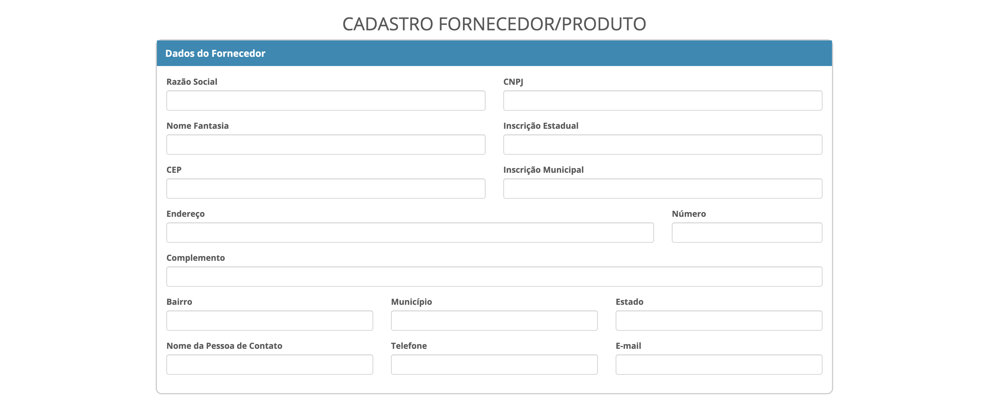
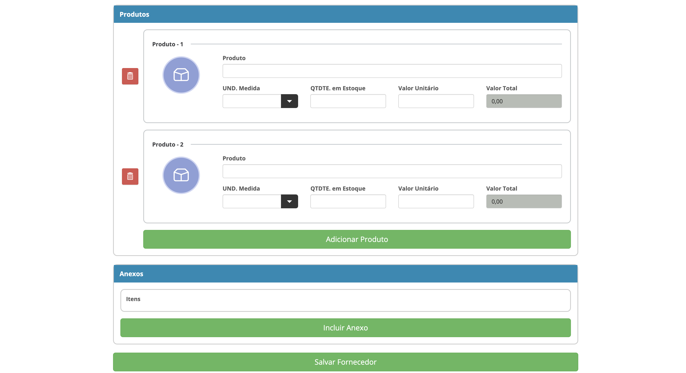

<h1 align="center">
  Cadastro de Fornecedor/Produto
</h1>

<p align="center">
  <a href="#-tecnologias">Tecnologias</a>&nbsp;&nbsp;&nbsp;|&nbsp;&nbsp;&nbsp;
  <a href="#-projeto">Projeto</a>&nbsp;&nbsp;&nbsp;|&nbsp;&nbsp;&nbsp;
  <a href="#-como-executar">Como executar</a>&nbsp;&nbsp;&nbsp;|&nbsp;&nbsp;&nbsp;
  <a href="#-como-usar">Como usar</a>&nbsp;&nbsp;&nbsp;|&nbsp;&nbsp;&nbsp;
  <a href="#-estrutura">Estrutura</a>&nbsp;&nbsp;&nbsp;|&nbsp;&nbsp;&nbsp;
  <a href="#-json-exemplo">JSON exemplo</a>
</p>

<p align="center">
  
  
</p>

<br>

<p align="center">
  
    
</p>

## 🚀 Tecnologias
Esse projeto foi desenvolvido com:

- HTML5  
- CSS (Fluig Style Guide)  
- JavaScript (jQuery 3.5.1)  
- Git e GitHub

## 💻 Projeto
Formulário para cadastro de **Fornecedor**, **Produtos** e **Anexos** com:
- Busca de endereço por **CEP (ViaCEP)**  
- Cálculo automático do **Valor Total** do produto  
- Validações de campos  
- Armazenamento de anexos em memória (base64)  
- Geração e **download do JSON** 

## ▶️ Como executar
- **Rápido:** abra `index.html` direto no navegador.  
- **Recomendado (servidor local):**
  - Python: `python -m http.server 5500` → acesse `http://localhost:5500`
  - Ou VS Code *Live Server* / `npx http-server -p 5500`

> Com servidor local, a busca de CEP e o download do JSON funcionam de forma mais consistente.

## 🧭 Como usar
1. **Fornecedor:** preencha os campos. Ao sair do **CEP**, endereço é preenchido automaticamente.  
2. **Produtos:** informe **Descrição**, **UND**, **Quantidade** e **Valor Unitário**. O **Valor Total** é calculado (readonly).  
3. **Anexos:** use **Incluir Anexo**. “Visualizar” baixa o arquivo; “Excluir” remove da lista.  
4. **Salvar Fornecedor:** valida tudo, exibe loading e **baixa o JSON** (também aparece no console).

> O desafio permite **baixar** ou **apenas exibir** o JSON no console.

## 📁 Estrutura

├─ index.html
├─ css/
│ └─ styles.css
├─ js/
│ └─ app.js
└─ docs/
├─ preview-desktop.png
├─ preview-mobile.png
└─ products-section.png


## 🗂️ JSON exemplo
```json
{
  "fornecedor": {
    "razaoSocial": "Exemplo Ltda",
    "nomeFantasia": "Fornecedor Exemplo",
    "cnpj": "12345678000199",
    "inscricaoEstadual": "123456789",
    "inscricaoMunicipal": "1234567",
    "endereco": {
      "cep": "42702-903",
      "logradouro": "Rua Exemplo",
      "numero": "123",
      "bairro": "Centro",
      "municipio": "Salvador",
      "uf": "BA",
      "complemento": null
    },
    "contato": {
      "nome": "Fulano",
      "telefone": "71999999999",
      "email": "fulano@exemplo.com"
    }
  },
  "produtos": [
    {
      "descricao": "Produto A",
      "unidade": "UN",
      "quantidade": 10,
      "valorUnitario": 5.5,
      "valorTotal": 55
    }
  ],
  "anexos": [
    {
      "nome": "documento.pdf",
      "mime": "application/pdf",
      "tamanho": 12345,
      "base64": "data:application/pdf;base64,JVBERi0xLjQK..."
    }
  ]
}

::contentReference[oaicite:0]{index=0}
